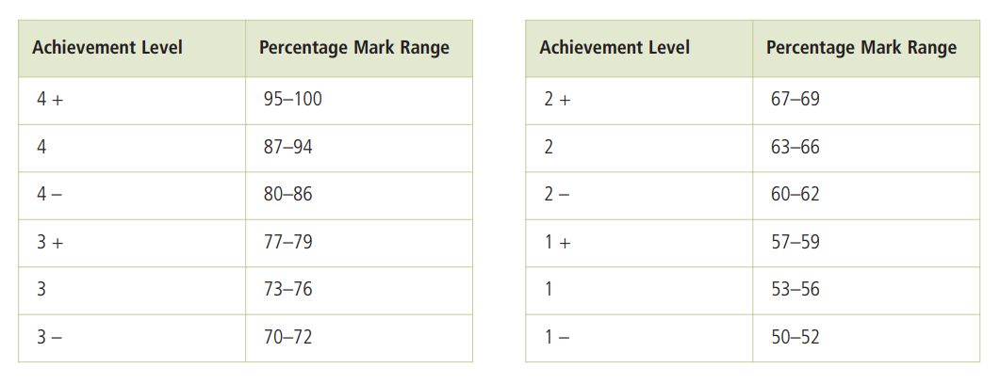

# Exercise 08 - Level Grade

In this assignment, you will write a program that uses `elif` and `else` clauses.

## Background

In Ontario, grades are typically assigned as a percent or a level.  The government provides the following table to convert percent grades into levels:



Any grade below 50% is assigned a level grade of "R".

## Requirements

The program should:

1. Ask the user for the user's grade as a percent.
    * The input is invalid if it is not a number between 0 and 100.  If the input is invalid, print the error message `Invalid percent!`.
2. Determine the level grade (using the table above) and print it using the format below.

### Sample Executions

*NOTE: These samples are not an exhaustive list of possible cases.  You should test your code with many different inputs.*

#### Sample 1
```
What is your percent grade? 90

Your level grade is 4.
```

#### Sample 2
```
What is your percent grade? 72

Your level grade is 3-.
```

#### Sample 3
```
What is your percent grade? 42

Your level grade is R.
```

#### Sample 4
```
What is your percent grade? -5
Invalid percent!
```

### Notes

* All error messages need to be printed to the standard error stream.
* After an error message is printed, end the program immediately.

## Submitting

When you are finished, push your code to GitHub.  Submit it on [Gradescope](https://www.gradescope.com) where it will be automatically tested for correctness.
